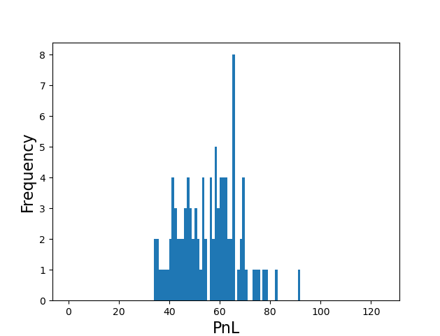

# Avellaneda-Stoikov HFT model implementation

Avellaneda-Stoikov HFT market making algorithm implementation

# Quickstart

Set up python environment:
```
python3 -m virtualenv venv
#source venv/bin/activate #linux
venv\Scripts\activate.bat # windows
```
Install dependencies:
```
pip install -r requirements.txt
```
Check model parameters in main.py and then execute the code:
```
python main.py
```

## Results

Figure 1 show results of a simulation using the following parameters:
- gamma: 0.1
- sigma: 2
- T: 1
- k: 1.5
- M: 0.5

The first chart shows price, indiference price and bid, ask quotes evolution.
The second chart shows the profit and loss evolution.
The last chart shows the inventory evolution.


Figure 2 shows the distribution of PnL over 1000 simulations.


